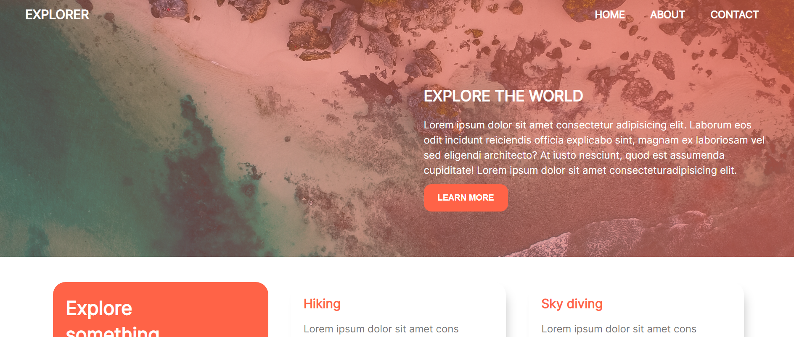

# dx-explore

A simple responsive adventure website that suggests adventure items that would guide end end users decision on things to try out, A complete guide about how to build this project from scratch is covered in this [Youtube video](https://www.youtube.com/)

## Preview Application

- https://dx-explore.netlify.app/

## Figma design

- https://www.figma.com/file/48O6jwwqsRTbss0WXKKj1W/Dx-Explorer?node-id=0%3A1

## Youtube Tutorial Link

- https://youtu.be/jz4SY1XyxlI

# Steps to use Application

- Download Entire code
- Open the index.html file

Feel free to edit and use as you like, A credit to the original authors [Israel Akinwumi](https://twitter.com/akinwumidi) and [Xerax labs](https://twitter.com/xeraxlabs) will be appreciated.

## Help / Collaboration

Need help making this project work, want to collaborate on future project or hire me? you can reach out via

- [LinkedIn](https://www.linkedin.com/in/akinwumidi)
- [Twitter](https://twitter.com/akinwumidi)

# Technologies Used

- HTML
- CSS [ Styling ]
- Fontawesome [ Icons ]

## Special Thanks

Partners

- De whales Organization

## Defaults

Default variables used

```css
:root {
  --main-color: #ff6347;
  --white-color: #fff;
  --black-color: #000;
  --gray-color: #777;
  --box-shadow: 7px 11px 20px -10px rgba(0, 0, 0, 0.33);
  --linear-gradient: linear-gradient(
    to right,
    rgba(255, 99, 71, 0.3),
    rgba(255, 99, 71, 0.6)
  );
}
```

## Related

- [FoodPlug](https://github.com/Xeraxlabs/DX1.0-Foodplug)

## License

Explore is licensed under the [MIT license](http://opensource.org/licenses/MIT).
